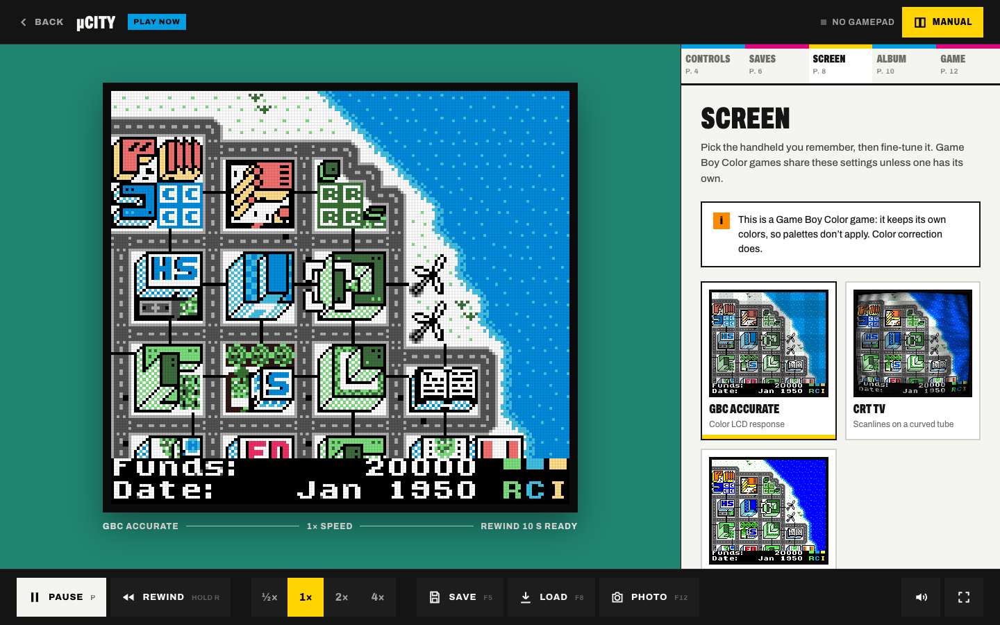
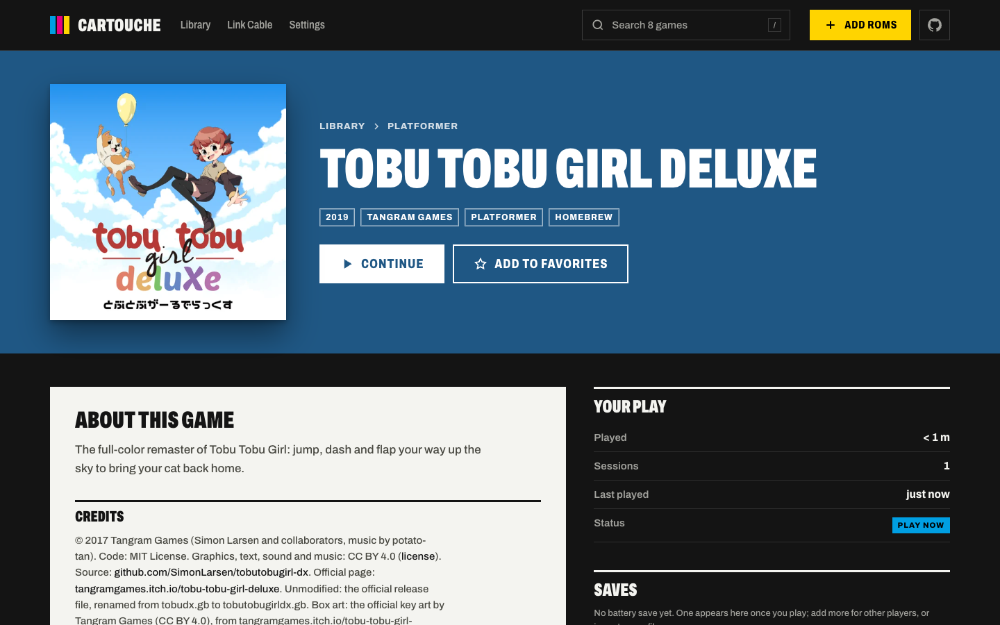
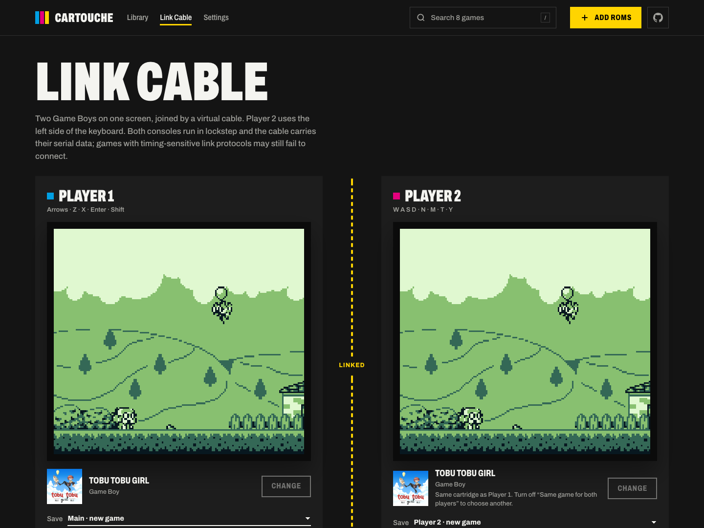
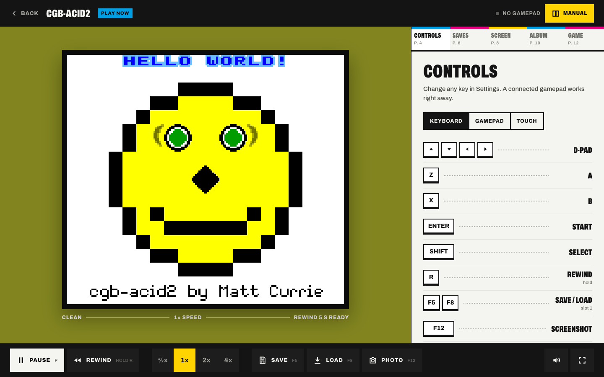

<p align="center">
  <a href="https://phmatray.github.io/cartouche/"></a>
</p>

<p align="center">
  <a href="https://phmatray.github.io/cartouche/"><b>Play now in your browser</b></a> ·
  <a href="#features">Features</a> ·
  <a href="#accuracy">Accuracy</a> ·
  <a href="#privacy">Privacy</a> ·
  <a href="#building-from-source">Build</a>
</p>

<p align="center">
  <a href="https://github.com/phmatray/cartouche/actions/workflows/ci.yml"></a>
  <a href="https://github.com/phmatray/cartouche/releases/latest"></a>
  <a href="https://phmatray.github.io/cartouche/"></a>
  
  <a href="LICENSE"></a>
</p>

**Cartouche turns your Game Boy and Game Boy Color cartridges into a library you
can play in any browser.** Drop in the ROMs you dumped from your own
cartridges: each one is recognized, shelved and ready to play in seconds, on a
laptop, a phone or a TV. There is nothing to install, no account, and
nothing ever leaves your browser.

Under the hood is an emulator written in Rust and compiled to WebAssembly. It
passes all of Blargg's hardware test suites and matches the acid2 reference
images pixel for pixel.

## Try it in ten seconds

Open **[phmatray.github.io/cartouche](https://phmatray.github.io/cartouche/)**.
Three free games ship with the app and play offline right away:
**Tobu Tobu Girl**, **Tobu Tobu Girl Deluxe** and the city builder **µCity**.
Three test cartridges let you watch the emulator prove itself: cgb-acid2,
dmg-acid2 and Blargg's `cpu_instrs`, which prints `Passed all tests` after
about a minute.

<table>
  <tr>
    <td width="50%"></td>
    <td width="50%"></td>
  </tr>
  <tr>
    <td><b>A shelf for your cartridges.</b> Your last game waits in a panel
    tinted with its own colors, your collection stands behind it, and search
    finds anything with <kbd>/</kbd>.</td>
    <td><b>A player built like a manual.</b> Controls, five save slots, screen
    styles and your screenshots live in tabbed pages next to the game.</td>
  </tr>
  <tr>
    <td></td>
    <td></td>
  </tr>
  <tr>
    <td><b>Every cartridge gets a page.</b> Cartridge header details, play time,
    your resume point and save slots, and your screenshot album.</td>
    <td><b>Two players, one screen.</b> The link cable page runs two consoles
    side by side and passes real serial data between them.</td>
  </tr>
</table>

<p align="center">
  
  &nbsp;
  
  &nbsp;
  
</p>

## Features

**Play**
- Game Boy (DMG) and Game Boy Color (CGB) games, including double speed,
  HDMA and color palettes.
- Super Game Boy games play with their own border and colors (per-game switch),
  and up to four players with more than one gamepad.
- MBC1, MBC2, MBC3 (with clock) and MBC5 cartridges, with battery saves kept
  automatically.
- Rewind by holding <kbd>R</kbd>, speed from ½× to 4×, and five save-state slots with
  thumbnails.
- A resume point is saved every time you leave, so **Continue** puts you back
  exactly where you were.
- Four LCD looks (DMG Classic, Pocket, Light, Clean), an optional pixel grid,
  and fullscreen.
- Neural 4× upscaling: a small network trained on Game Boy tile maps rounds off
  pixel-art edges, never moves an original pixel, and stays steady while scrolling.
  It adds detail that wasn't in the original pixels ([how it was made](docs/NEURAL.md)).
- Smooth motion (opt-in) for 120 Hz screens: in-between frames from the emulator's
  exact scroll and sprite positions, for about 8 ms of added delay.
- Screenshots with <kbd>F12</kbd>, saved to a per-game album and exportable
  as PNG.

**Control**
- Keyboard with remappable keys, any standard gamepad, or on-screen touch
  controls on phones.
- Arrow-key navigation across the library for TVs and couch play.

**Organize**
- Drop ROMs anywhere in the app. They are identified by SHA-1 against
  thousands of known Game Boy and Game Boy Color dumps, so titles, developers
  and years fill themselves in.
- Favorites, faceted search (genre, players, region, year, developer… or type `genre:rpg players:2`), sorting, filters, and grid or list views.
- Optional box art for recognized games. It is off by default: Cartouche asks
  first, and covers are then downloaded by your browser and stored only there.
- Export your whole library (ROMs, saves, screenshots, settings) to one backup
  file, and restore it anywhere.

**Install**
- Install it as an app from your browser. It works offline after the first
  visit.

## Accuracy

The core is checked against the public hardware test ROMs that emulator
authors rely on. Every suite below passes in CI on each commit.

| Suite | What it checks | Result |
|---|---|---|
| Blargg `cpu_instrs` | Every CPU instruction | ✅ 11/11 |
| Blargg `instr_timing`, `mem_timing`, `mem_timing-2` | Instruction and memory access timing | ✅ |
| Blargg `interrupt_time`, `halt_bug` | Interrupt timing and the HALT bug | ✅ |
| Blargg `dmg_sound`, `cgb_sound` | All four sound channels, DMG and CGB | ✅ 12/12 each |
| Blargg `oam_bug` | The DMG OAM corruption bug | ✅ 8/8 ¹ |
| dmg-acid2, cgb-acid2 | PPU rendering, pixel for pixel against the reference | ✅ |
| Homebrew smoke tests | Freely licensed GB and GBC games run without freezing | ✅ |
| Link cable | Serial transfers between two consoles | ✅ |

¹ Test 7 runs inside the combined `oam_bug.gb`. Run on its own, that ROM
overruns its 8 KB text log and overwrites its own code, so it cannot finish on
any emulator. The details are in [CHANGELOG.md](CHANGELOG.md).

```bash
./scripts/fetch-test-roms.sh                  # downloads the test ROMs (not stored in this repo)
cd gb-core && cargo test --release --no-fail-fast
```

## Privacy

- No account, no server, no analytics, no cookies, no tracking.
- Your ROMs, saves, screenshots and settings stay in your browser (IndexedDB).
  Nothing is uploaded.
- Only GitHub is contacted (unless you connect RetroAchievements, below). GitHub Pages serves the app. Box art is off until
  you agree in the "Show box art?" dialog; after that, covers of recognized
  games come from `raw.githubusercontent.com`. Like any web server, GitHub sees
  your IP address
  ([GitHub privacy statement](https://docs.github.com/en/site-policy/privacy-policies/github-general-privacy-statement)).
- Settings › Storage shows what is stored and deletes it, box art included.
- RetroAchievements is off until you connect in Settings › Achievements with your
  username and web API key (never your password; both stay in the browser). Then
  `retroachievements.org` is asked for your earned achievements, read-only
  ([why nothing is unlocked](docs/RETROACHIEVEMENTS.md)). ROMs are matched by MD5
  in the browser and never sent.

## Your own cartridges

Cartouche plays ROM files you provide. The legal way to get them is to back up
cartridges you own with a cartridge reader such as the GB Operator (Epilogue)
or the GBxCart RW (insideGadgets). Laws on backups differ between countries,
so check yours. Don't download ROMs of games you don't own, and don't share
your dumps.

## Building from source

You need Rust stable with the `wasm32-unknown-unknown` target,
[wasm-pack](https://rustwasm.github.io/wasm-pack/), Node.js 24 and npm.

```bash
rustup target add wasm32-unknown-unknown

cd gb-core && wasm-pack build --target web --out-dir pkg && cd ..   # WebAssembly core
cd gb-web && npm ci && npm run dev                                  # dev server

./scripts/build.sh                                                  # production build
```

| Path | What lives there |
|---|---|
| `gb-core/` | The emulator: SM83 CPU, PPU, APU, timers, cartridges, link port (Rust → WASM) |
| `gb-web/` | The app: React 19, Vite, Tailwind CSS v4, Zustand |
| `gb-core/tests/` | Blargg, acid2, CGB, homebrew and link cable tests |
| `scripts/` | Test ROM download and build scripts |

## Legal

Game Boy and Game Boy Color are trademarks of Nintendo. Cartouche is not
affiliated with, sponsored by or endorsed by Nintendo. Game titles belong to
their owners and are used only to identify games.

Cartouche contains no Nintendo code and no Nintendo BIOS or boot ROM; games
start with SameBoy's open-source (MIT) boot ROMs, or directly in the documented
post-boot state. **No commercial ROMs are provided,
hosted or linked.** The six ROMs bundled with the app are redistributed under
their authors' licenses, listed with checksums in
[THIRD_PARTY_NOTICES.md](THIRD_PARTY_NOTICES.md).

Read [docs/LEGAL.md](docs/LEGAL.md) for the full notice, the box art and
metadata policy, and how to request a takedown.

## Contributing

Contributions are welcome: start with [CONTRIBUTING.md](CONTRIBUTING.md). The
one rule that is never bent: don't add, attach or link to ROMs, BIOS files or
other copyrighted material. Security reports go through
[SECURITY.md](SECURITY.md).

## Credits

Tobu Tobu Girl and Tobu Tobu Girl Deluxe by Tangram Games · µCity by Antonio
Niño Díaz · dmg-acid2 and cgb-acid2 by Matt Currie · test ROMs by Shay Green
(Blargg) · game metadata from GameDataBase by PigSaint and libretro-database ·
Archivo typeface by Omnibus-Type · Neural 4× learned to imitate xBRZ by Zenju.

## License

Cartouche is released under the [MIT License](LICENSE). Bundled third-party
material keeps its own license; see [THIRD_PARTY_NOTICES.md](THIRD_PARTY_NOTICES.md).
