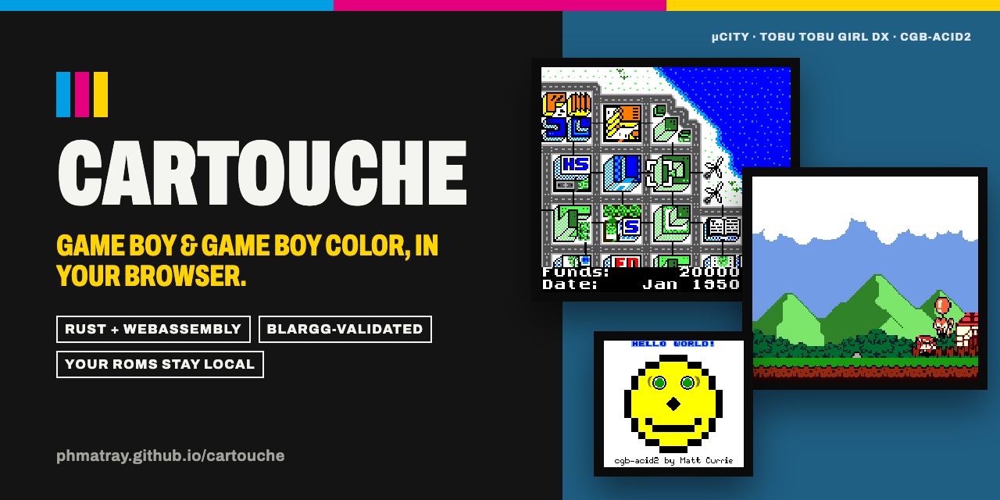
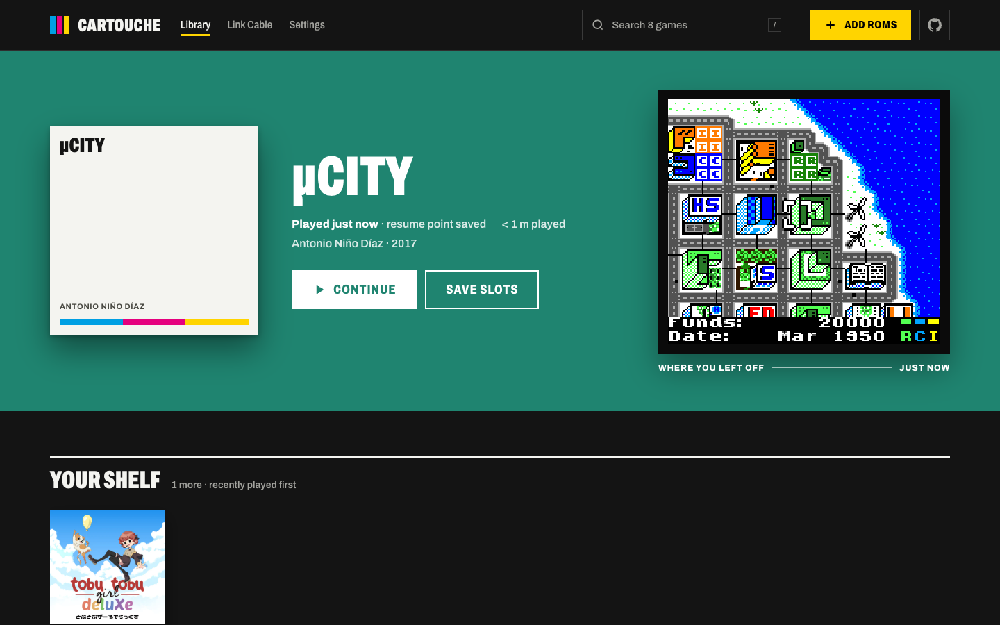
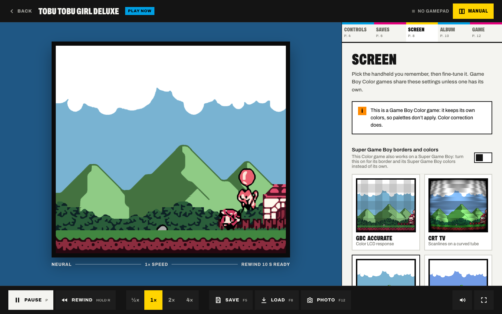
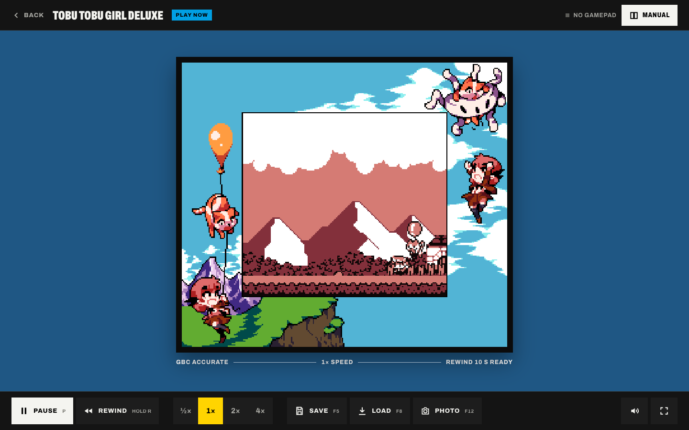
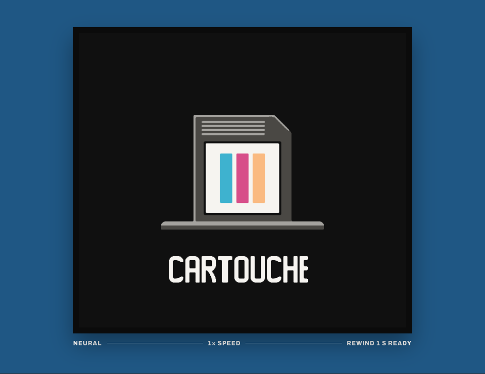
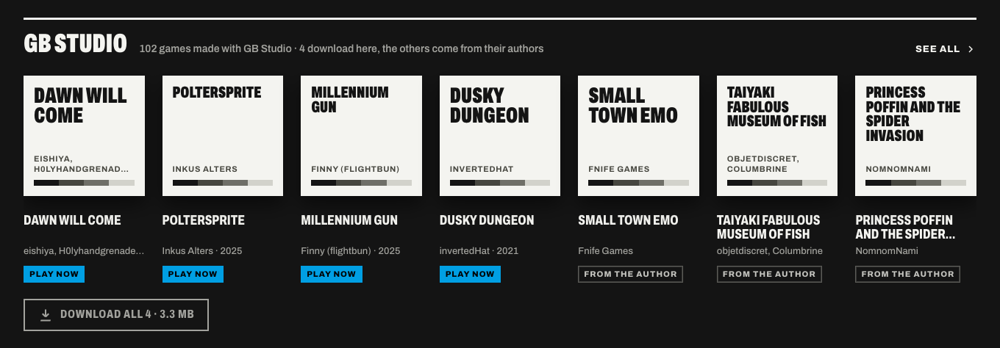
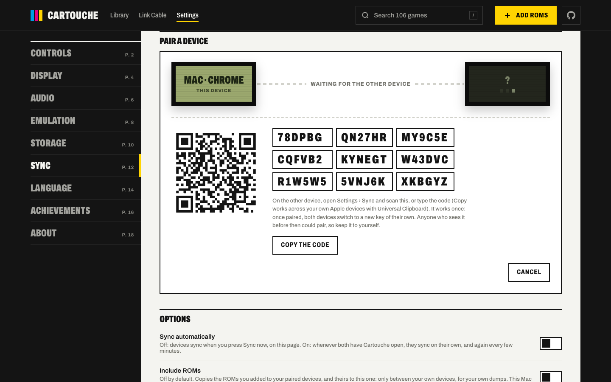
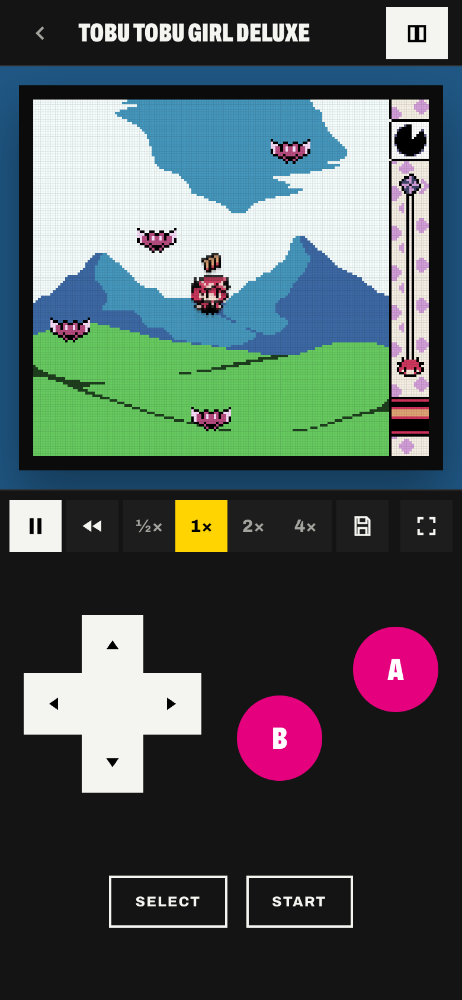
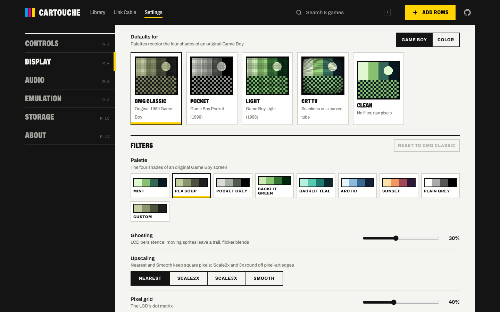
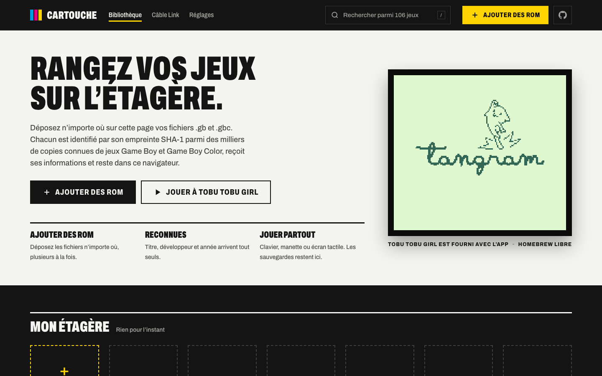

<p align="center">
  <a href="https://phmatray.github.io/cartouche/"></a>
</p>

<p align="center">
  <a href="https://phmatray.github.io/cartouche/"><b>Play now in your browser</b></a> ·
  <a href="#features">Features</a> ·
  <a href="#install-on-iphone">iPhone</a> ·
  <a href="#privacy">Privacy</a> ·
  <a href="#building-from-source">Build</a>
</p>

<p align="center">
  <a href="https://github.com/phmatray/cartouche/actions/workflows/ci.yml"></a>
  <a href="https://github.com/phmatray/cartouche/releases/latest"></a>
  <a href="https://phmatray.github.io/cartouche/"></a>
  
  
  <a href="LICENSE"></a>
</p>

**Cartouche is a Game Boy and Game Boy Color emulator that runs in your
browser and treats your cartridges like a collection.** Open the page, drop in
the ROMs you dumped from your own cartridges, and play in seconds on a laptop, a
phone or a TV. Three free games play right away, four more download with one
tap, and two players can link up across the internet. There is no
account and no server: your games and saves stay in your browser.

The emulator is written in Rust and compiled to WebAssembly. It passes all of
Blargg's hardware test suites and matches the acid2 reference images pixel for
pixel.

## Contents

- [Try it in ten seconds](#try-it-in-ten-seconds)
- [Screenshots](#screenshots)
- [Features](#features)
- [Install on iPhone](#install-on-iphone)
- [Accuracy](#accuracy)
- [Privacy](#privacy)
- [Your own cartridges](#your-own-cartridges)
- [Roadmap](#roadmap)
- [Building from source](#building-from-source)
- [Legal](#legal)
- [Contributing](#contributing)
- [Credits and licenses](#credits-and-licenses)

## Try it in ten seconds

Open **[phmatray.github.io/cartouche](https://phmatray.github.io/cartouche/)**.
Three free games ship with the app and play offline right away:
**Tobu Tobu Girl**, **Tobu Tobu Girl Deluxe** and the city builder **µCity**.
Four more GB Studio games download with one tap: **Dawn Will Come**,
**Poltersprite**, **Millennium Gun** and **Dusky Dungeon**. Three test
cartridges (cgb-acid2, dmg-acid2 and Blargg's `cpu_instrs`) let you watch the
emulator prove itself; hide them in Settings if you'd rather not see them.

## Screenshots

<table>
  <tr>
    <td width="50%"></td>
    <td width="50%"></td>
  </tr>
  <tr>
    <td><b>Your library.</b> The last game you played waits with its resume
    point, tinted with its own colours. Search finds anything with <kbd>/</kbd>.</td>
    <td><b>Neural 4×.</b> A small network trained on Game Boy tile maps rounds
    off pixel-art edges without moving a single original pixel.</td>
  </tr>
  <tr>
    <td></td>
    <td></td>
  </tr>
  <tr>
    <td><b>Super Game Boy.</b> Games made for it play with their own border
    and colours.</td>
    <td><b>Start-up animations.</b> Cartouche's own artwork and chime, from its
    own boot ROMs. No Nintendo logo.</td>
  </tr>
  <tr>
    <td></td>
    <td></td>
  </tr>
  <tr>
    <td><b>GB Studio collection.</b> 102 games made with GB Studio; four
    download here, the rest link to their authors.</td>
    <td><b>Device sync.</b> Pair your phone and your computer with a QR code;
    saves travel between them, end-to-end encrypted.</td>
  </tr>
</table>

<p align="center">
  
  &nbsp;
  
  &nbsp;
  
</p>

## Features

**Play**
- Game Boy and Game Boy Color games, with MBC1, MBC2, MBC3 (with clock), MBC5, HuC1, HuC3 (with clock), MBC7 (tilt, played by tilting your phone or with a gamepad stick or the keyboard), MMM01 multi-game, MBC6 (with flash) and Bandai TAMA5 (with clock) cartridges and battery saves kept automatically.
- A resume point every time you leave, so **Continue** puts you back where you were.
- Five save-state slots with thumbnails, per-game save profiles, rewind (hold <kbd>R</kbd>) and speed from ½× to 4×.
- Keyboard with remappable keys, any standard gamepad, or touch controls on phones and tablets.
- Touch skins (Cartouche, Brick, Pocket, Color, Clear), a layout editor to move, resize and fade each control, and hold buttons for rewind and fast-forward.
- Pocket camera cartridges see through your camera (or a photo you pick).
- The Game Boy Printer sits on the link port: prints feed out of a tray, land in your album and export as PNG.
- Rumble cartridges drive gamepad motors or phone vibration (Android; iPhone gives websites no vibration).
- The screen stays awake while you play.

**Library**
- Drop ROMs, or a `.zip` of them, anywhere in the app; duplicates are caught before they're stored.
- Files are identified by SHA-1 against thousands of known dumps, so titles, developers and years fill themselves in.
- Faceted search (genre, players, region, year, developer and more, or type `genre:rpg players:2`), favorites, sorting, grid or list, A–Z jump.
- A GB Studio collection of 102 homebrew games: four download with one tap, the others link to their authors' pages.
- Every game has a page with its cartridge details, play time, saves and screenshot album.
- Optional box art for games you added, off until you say yes.
- One backup file holds your ROMs, saves, screenshots and settings; restore it anywhere.
- Install it as an app from the menu; it works offline after the first visit. The footer shows the version.

**Look**
- Screen presets: DMG Classic, Pocket, Light, GBC Accurate, CRT TV, Clean and Neural, each tunable, globally or per game.
- Neural 4× upscaling rounds off edges and curves, never moves an original pixel, and stays steady while scrolling ([how it was made](docs/NEURAL.md)).
- Smooth motion (opt-in) draws in-between frames for 120 Hz screens from the emulator's exact scroll and sprite positions.
- Three start-up animations (Registration, Insert, Shelf pick) or none, previewed live in Settings; <kbd>Start</kbd> skips them.
- Original Game Boy games can run on the Game Boy Color with its automatic colours or any of its 12 button-combination palettes.
- Super Game Boy games play with their border and colours by default. SNES-side music and effects play when the game brings its own sound program. The Super Game Boy's built-in sound effects are Cartouche's own approximations, made from their names alone, not the original sounds. Games relying on its built-in music still switch to the Game Boy, with a notice.
- Screenshots with <kbd>F12</kbd>, kept per game, exported as PNG or shared from the album.

**Play together**
- Link cable on one screen: two consoles side by side, real serial data between them, and infrared between two Color consoles (Mystery Gift and the like) or HuC1 and HuC3 cartridges, which carry their own.
- Link cable online: two browsers joined by a room code, invite link or QR code, peer to peer over WebRTC ([how it works](docs/ONLINE_LINK.md)). When both players have both games, each browser runs both consoles in lockstep and only the buttons cross: real-time link games play at full speed with about two frames of input delay (rollback hides the rest of the round trip), infrared included. Otherwise only the cable's bytes cross: fine for turn-based exchanges, while real-time link games stutter once the round trip passes a few tens of milliseconds.
- Super Game Boy multiplayer: up to four players with several gamepads.

**Your data**
- Everything lives in your browser; no account, no server of ours.
- Device sync between your own devices, paired by QR code and end-to-end encrypted: saves, states, favorites, play time and settings, and ROMs if both sides allow it ([how it works](docs/SYNC.md)).
- RetroAchievements: connect your account to see a game's achievements and which ones you earned, and sign in to unlock them as you play (softcore; [details](docs/RETROACHIEVEMENTS.md)).
- Settings › Storage shows what is stored and deletes any of it.

**Accessibility and languages**
- English, French and Spanish, following your browser or chosen in Settings.
- Full keyboard and gamepad navigation with a visible focus, for desks and TVs alike.
- Touch targets of at least 44 px; reduced-motion preferences are respected (the start-up animation is off for them).

## Install on iPhone

1. Open [phmatray.github.io/cartouche](https://phmatray.github.io/cartouche/) in **Safari**.
2. Tap **Share** (on recent iOS it is in the **⋯** menu), then **Add to Home Screen**.
3. Open Cartouche from its icon: it runs full screen, plays offline and keeps your saves.

To bring your ROMs over, put them in a folder in iCloud Drive, long-press the
folder in the Files app and choose **Compress**, then pick that `.zip` in
Cartouche. A Home Screen app keeps its own storage apart from Safari's, so use
[device sync](docs/SYNC.md) or a backup file to carry saves between the two.

On Android and desktop browsers, use **Install** in Cartouche's menu or the
browser's own install button.

## Accuracy

The core is checked against the public hardware test ROMs that emulator
authors rely on. Every suite below runs in CI on each commit; known failures are
listed, not hidden, in `gb-core/tests/expected-failures.txt`. Some gbmicrotest
ROMs are hardware probes, not tests: their source records no expected value, so
nothing can pass or fail. They are listed in `gb-core/tests/probes-without-verdict.txt`
and still run on every commit, but only to check that the emulator does not
crash. They are not counted in the score.

| Suite | What it checks | Result |
|---|---|---|
| Blargg `cpu_instrs` | Every CPU instruction | ✅ 11/11 |
| Blargg `instr_timing`, `mem_timing`, `mem_timing-2` | Instruction and memory access timing | ✅ |
| Blargg `interrupt_time`, `halt_bug` | Interrupt timing and the HALT bug | ✅ |
| Blargg `dmg_sound`, `cgb_sound` | All four sound channels, DMG and CGB | ✅ 12/12 each |
| Blargg `oam_bug` | The DMG OAM corruption bug | ✅ 8/8 ¹ |
| dmg-acid2, cgb-acid2 | PPU rendering, pixel for pixel against the reference | ✅ |
| Homebrew smoke tests | Freely licensed GB and GBC games run without freezing | ✅ |
| Link cable | Serial transfers between two consoles | ✅ |
| Infrared (CGB, HuC1, HuC3) | Light between the two consoles of the link page | ✅ |
| Mooneye acceptance | Timers, DMA, interrupts, PPU and instruction timing | 74/75 |
| Mooneye emulator-only MBC | MBC1, MBC2 and MBC5 banking | 28/28 |
| Mealybug Tearoom | Mid-scanline PPU register changes, pixel for pixel | 26/51 ³ |
| SameSuite | APU, HDMA and interrupt edge cases (CGB), SGB multiplayer | 71/78 |
| Age | PPU, STAT, OAM/VRAM access and double-speed timing | 20/51 |
| gbmicrotest | Cycle-level timer, interrupt and PPU behaviour | 455/490 ² |
| rtc3test | The MBC3 real-time clock | 6/6 |

¹ Test 7 runs inside the combined `oam_bug.gb`. Run on its own, that ROM
overruns its 8 KB text log and overwrites its own code, so it cannot finish on
any emulator. The details are in [CHANGELOG.md](CHANGELOG.md).

² Plus 23 probes with no verdict (not a test), which run without an emulator
error and are not counted.

³ 13 of the 25 failures are rule-blocked: their reference screenshots show the
® that Nintendo's boot ROM leaves in video memory, which Cartouche does not ship,
and every pixel that differs is where that tile is drawn. They stay counted as
failures, in their own section of `expected-failures.txt`.

```bash
./scripts/fetch-test-roms.sh                  # downloads the test ROMs (not stored in this repo)
cd gb-core && cargo test --release --no-fail-fast
```

## Privacy

- No account, no server, no analytics, no cookies, no tracking.
- Your ROMs, saves, screenshots and settings stay in your browser (IndexedDB).
  Nothing is uploaded to a server.
- Only GitHub is contacted (unless you connect RetroAchievements, sign in to unlock achievements, play online or turn on device sync, below). GitHub Pages serves the app. Box art is off until
  you agree in the "Show box art?" dialog; after that, covers of recognized
  games come from `raw.githubusercontent.com`, and covers of GB Studio games
  from itch.io (`img.itch.zone`). Like any web server, GitHub (or itch.io) sees
  your IP address
  ([GitHub privacy statement](https://docs.github.com/en/site-policy/privacy-policies/github-general-privacy-statement)).
- Settings › Storage shows what is stored and deletes it, box art included.
- RetroAchievements is off until you connect in Settings › Achievements with your
  username and web API key (never your password; both stay in the browser). Then
  `retroachievements.org` is asked for your earned achievements. ROMs are matched
  by MD5 in the browser and not sent.
- Unlocking is off until you sign in under Settings › Achievements › "Unlock while
  playing" with your password, once: it goes to RetroAchievements through
  Cartouche's relay (a Cloudflare Worker that keeps nothing) and is never stored;
  only the session token stays in the browser. While a recognized game runs, the
  ROM's MD5 hash, your unlocks, leaderboard entries and rich presence pings go
  through the relay, so Cloudflare sees them and your IP address
  ([Cloudflare privacy policy](https://www.cloudflare.com/privacypolicy/),
  [details](docs/RETROACHIEVEMENTS.md)). "Sign out" stops it.
- Play online and device sync reach five public Nostr relays and Google and
  Cloudflare STUN servers to connect the two browsers: they see your IP address,
  and so does the other player or device. Game and sync data (saves, states,
  screenshots, ROMs if you turn that on) then go end-to-end encrypted, browser
  to browser ([details](docs/LEGAL.md)).
  No TURN relay is used unless you add your own, so some strict networks
  can't connect.

## Your own cartridges

Cartouche plays ROM files you provide. The legal way to get them is to back up
cartridges you own with a cartridge reader such as the GB Operator (Epilogue)
or the GBxCart RW (insideGadgets). Laws on backups differ between countries,
so check yours. Don't download ROMs of games you don't own, and don't share
your dumps.

## Roadmap

- **RetroAchievements hardcore**: unlocks are softcore for now; hardcore needs the emulator validated by RetroAchievements (eligible after six months public, from March 2027) and the hardcore rules in the player ([what is needed](docs/RETROACHIEVEMENTS.md)).
- **More hosted GB Studio games**, as authors choose licenses that allow it.
- **Live translation of in-game text**: research only for now.

Ideas and bug reports are welcome in [issues](https://github.com/phmatray/cartouche/issues).

## Building from source

You need Rust stable with the `wasm32-unknown-unknown` target,
[wasm-pack](https://github.com/drager/wasm-pack), Node.js 24 and npm.

```bash
rustup target add wasm32-unknown-unknown

cd gb-core && wasm-pack build --target web --out-dir pkg && cd ..   # WebAssembly core
cd gb-web && npm ci && npm run dev                                  # dev server

./scripts/build.sh                                                  # production build
```

| Path | What lives there |
|---|---|
| `gb-core/` | The emulator: SM83 CPU, PPU, APU, timers, cartridges, camera, printer, Super Game Boy, link port (Rust → WASM) |
| `gb-core/boot/`, `gb-core/boot-src/` | Cartouche's boot ROMs and their source, modified from SameBoy's |
| `gb-core/tests/` | Blargg, acid2, CGB, homebrew, link cable and Super Game Boy tests |
| `gb-web/` | The app: React 19, Vite, Tailwind CSS v4, Zustand |
| `scripts/` | Test ROM download, build and repository guard scripts |

## Legal

Game Boy, Game Boy Color and Super Game Boy are trademarks of Nintendo.
Cartouche is not affiliated with, sponsored by or endorsed by Nintendo. Game
titles belong to their owners and are used only to identify games.

Cartouche contains no Nintendo code, no Nintendo BIOS or boot ROM, and no copy
of the Nintendo logo. Games start with Cartouche's own boot ROMs (modified from
SameBoy's open-source MIT ones; they never read, show or check the logo), or
directly in the documented post-boot state. No Super Game Boy or SNES software
is included.

**Bring your own ROMs. No commercial ROMs are provided, hosted or linked, and
commercial games are never listed.** The six ROMs bundled with the app and the
four hosted GB Studio games are redistributed unmodified under their authors'
licenses, listed with checksums in [THIRD_PARTY_NOTICES.md](THIRD_PARTY_NOTICES.md).

Read [docs/LEGAL.md](docs/LEGAL.md) for the full notice, the box art and
metadata policy, and how to request a takedown.

## Contributing

Contributions are welcome: start with [CONTRIBUTING.md](CONTRIBUTING.md). The
one rule that is never bent: don't add, attach or link to ROMs, BIOS files or
other copyrighted material. Security reports go through
[SECURITY.md](SECURITY.md).

## Credits and licenses

Cartouche is released under the [MIT License](LICENSE). Bundled third-party
material keeps its own license; every work is listed in
[THIRD_PARTY_NOTICES.md](THIRD_PARTY_NOTICES.md), and every build ships the full
license texts.

| Work | Author | License |
|---|---|---|
| Boot ROMs (modified) | SameBoy, Lior Halphon | MIT |
| Tobu Tobu Girl, Tobu Tobu Girl Deluxe | Tangram Games | MIT (code), CC BY 4.0 (art, music) |
| µCity | Antonio Niño Díaz | GPL-3.0-or-later (art, music CC BY-SA 4.0) |
| dmg-acid2, cgb-acid2 | Matt Currie | MIT |
| `cpu_instrs` | Shay Green (Blargg) | no stated license; removed on request |
| Dawn Will Come | eishiya, H0lyhandgrenade, Kezia Salmon | MIT (code), CC BY 4.0 (art, music) |
| Poltersprite | Inkus Alters | CC BY-NC-SA 4.0 (game), GPL-3.0 (code) |
| Millennium Gun | Finny (Gonçalo Limas) | 0BSD (code), CC0 1.0 (art, audio), MIT (plugin) |
| Dusky Dungeon | invertedHat (Jan Klečka) | MIT, CC BY 4.0 (graphics, fonts), CC BY 3.0 (font) |
| Game metadata | GameDataBase by PigSaint, libretro-database | CC BY 4.0, CC BY-SA 4.0 |
| Peer-to-peer rooms | Trystero | MIT |
| QR codes | `uqr`, `qr` | MIT; MIT or Apache-2.0 |
| Archivo typeface | Omnibus-Type | SIL OFL 1.1 |

Neural 4× learned to imitate xBRZ by Zenju. The GPL sources of µCity and
Poltersprite are attached to every release.
